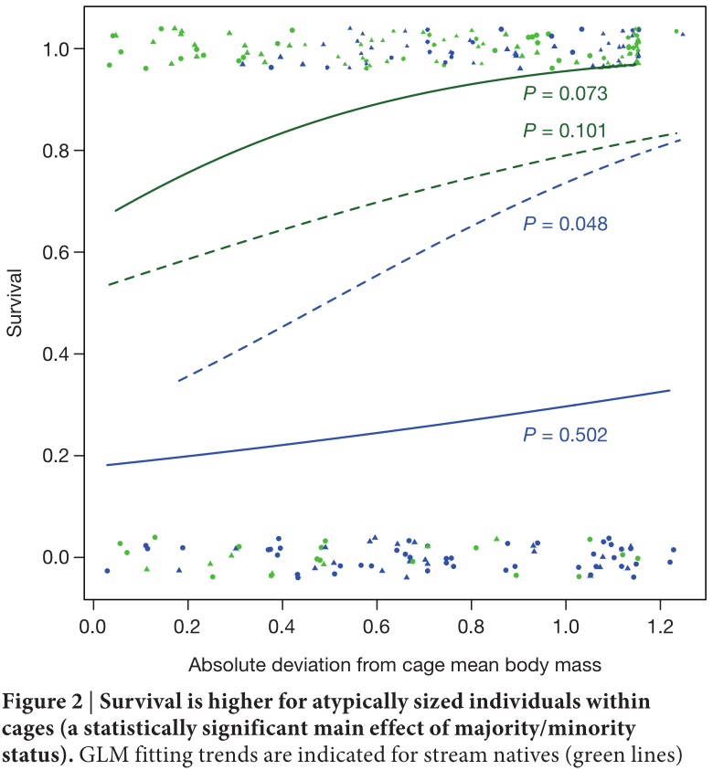
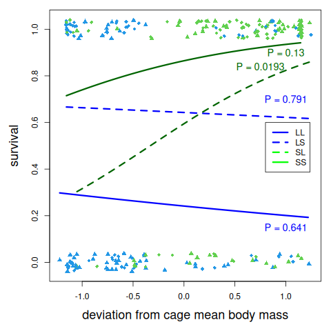
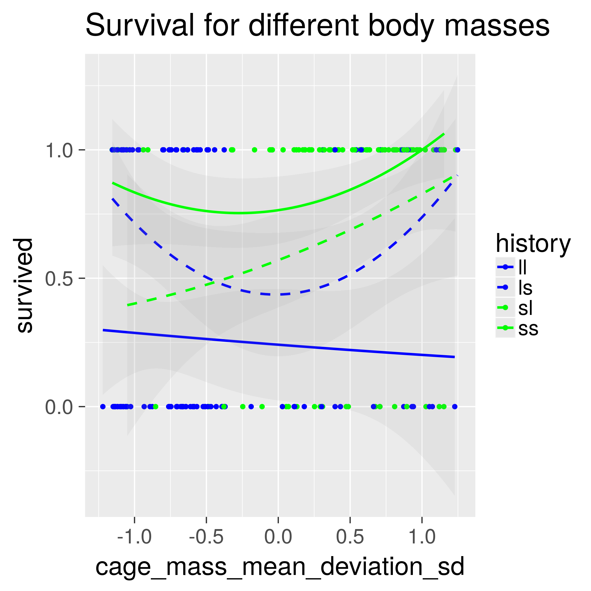
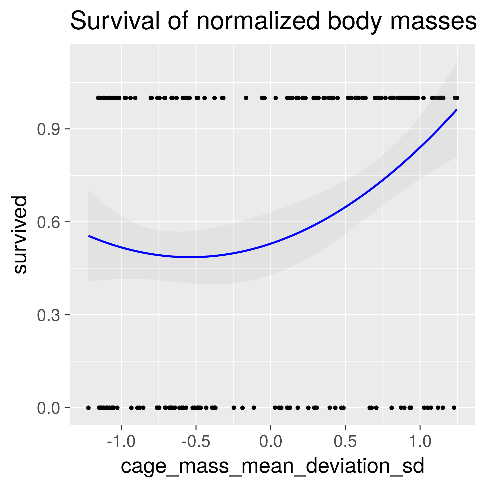
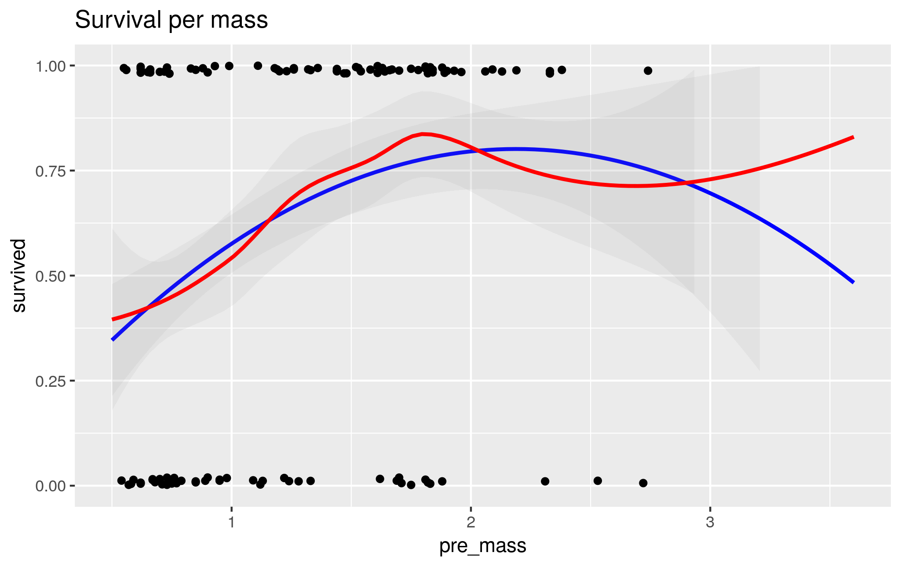
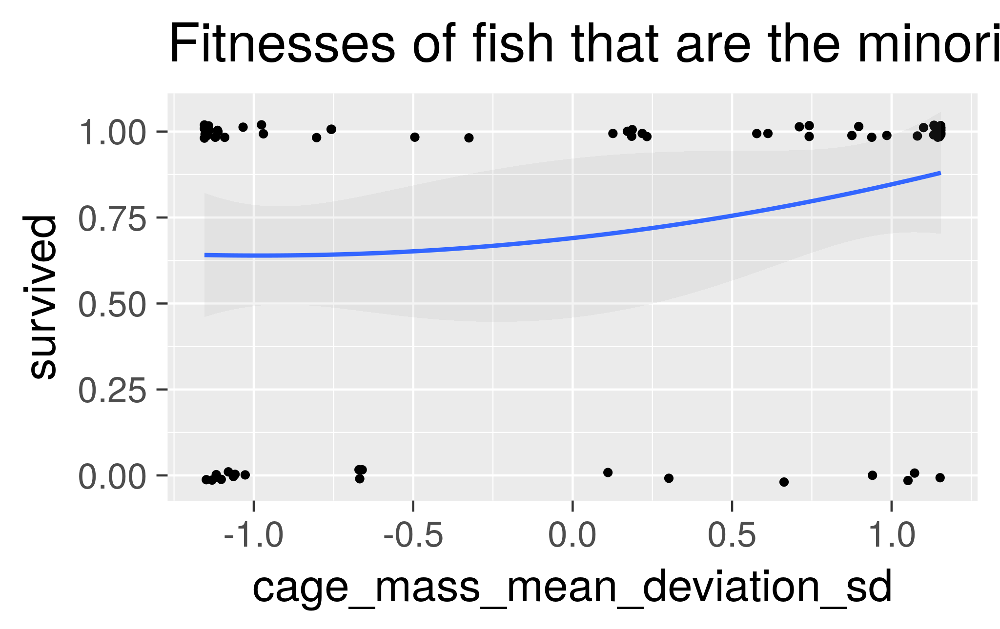

# Bolnick_and_Stutz_2017

Notes for `[Bolnick & Stutz, 2017]`.

The conclusion of the paper is that extreme body sizes fare better.
This can be shown in a plot that uses the *absolute* of the relative
normalized body mass, as shown in plot versions A (from the paper)
and B (reproduced from data) below.

When taking just the relative
normalized body mass, this pattern breaks down,
as shown in plot version C shown below.

Instead, the conclusion should be:

- in the lake: smaller individuals thrive
- in the stream: bigger individuals thrive.

<!-- markdownlint-disable MD013 --><!-- Tables cannot be split up over lines, hence will break 80 characters per line -->

Version|Figure 2 version|Description
-------|---------------------------------------------------|---------------------------------------------------
A      |   |As in paper
B      |       |Reproduced using author's code, see [fig2_complete.R](fig2_complete.R)
C      ||Reproduced using the real values, see [fig2_complete.R](fig2_complete.R)

<!-- markdownlint-enable MD013 -->

## Extra figures

With 95% confidence interval added:

Merge all four treatments:

> Relation between relative body mass and fitness

## Is there evidence that the extreme phenotypes survive better?

With a parabolic fit: yes

With a LOWESS fit: no

## Do minority fish have a higher fitness at the extremes?

No.

## References

- `[Bolnick & Stutz, 2017]` Bolnick, Daniel I., and William E. Stutz.
  "Frequency dependence limits divergent evolution by favouring rare
  immigrants over residents." Nature (2017).

## Files used by continuous integration scripts

<!-- markdownlint-disable MD013 --><!-- Tables cannot be split up over lines, hence will break 80 characters per line -->

Filename                                  |Descriptions
------------------------------------------|--------------------------------------------------------------------------------------------------------------------------------------
[mlc_config.json](mlc_config.json)        |Configuration of the link checker, use `markdown-link-check --config mlc_config.json --quiet docs/**/*.md` to do link checking locally
[.spellcheck.yml](.spellcheck.yml)        |Configuration of the spell checker, use `pyspelling -c .spellcheck.yml` to do spellcheck locally
[.wordlist.txt](.wordlist.txt)            |Whitelisted words for the spell checker, use `pyspelling -c .spellcheck.yml` to do spellcheck locally
[.markdownlint.jsonc](.markdownlint.jsonc)|Configuration of the markdown linter, use `markdownlint "**/*.md"` to do markdown linting locally. The name of this file is a default name.
[.markdownlintignore](.markdownlintignore)|Files ignored by the markdown linter, use `markdownlint "**/*.md"` to do markdown linting locally. The name of this file is a default name.

<!-- markdownlint-enable MD013 -->
