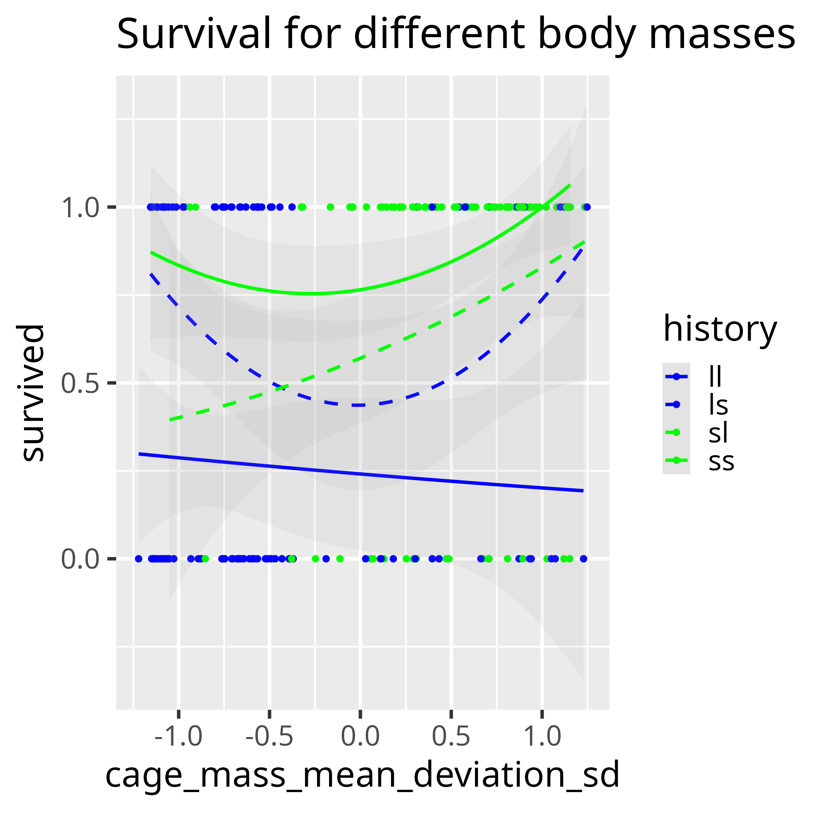
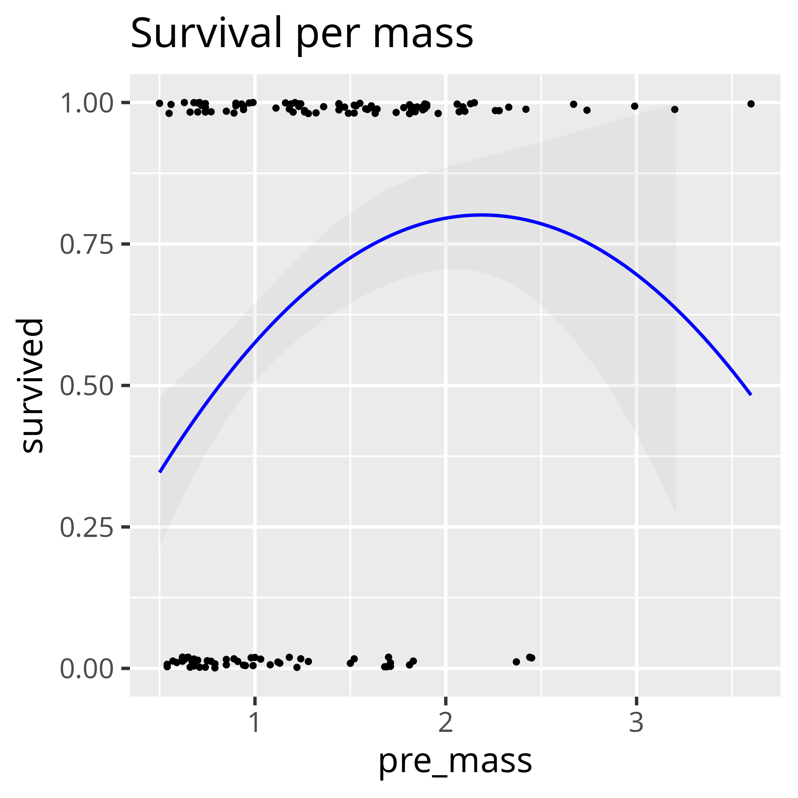

# Bolnick_and_Stutz_2017

Notes for Bolnick, Daniel I., and William E. Stutz. "Frequency dependence limits divergent evolution by favouring rare immigrants over residents." Nature (2017).

Extreme body sizes fare better, when taking the *absolute* of the relative
normalized body mass:

When taking just the relative
normalized body mass, this pattern breaks down:
 
 * in the lake: smaller individuals thrive
 * n the stream: bigger individuals thrive.

With 95% confidence interval added:

## Is there evidence that the extreme phenotypes survive better?

With a parabolic fit: yes

With a LOWESS fit: no

