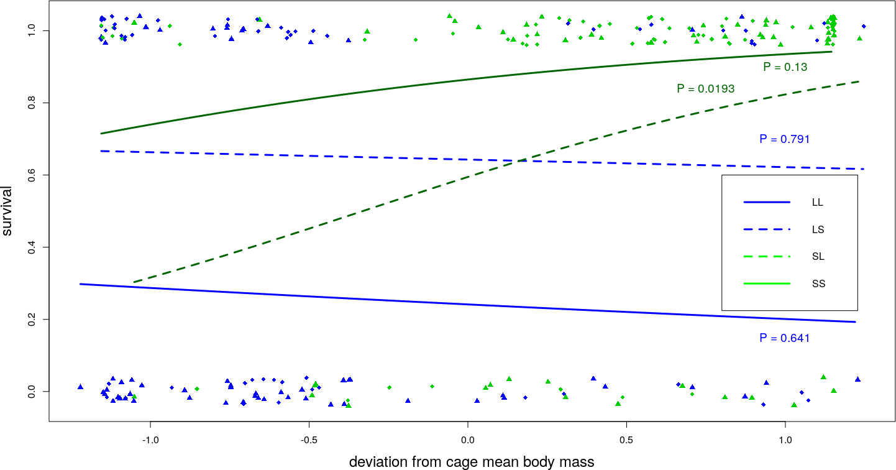
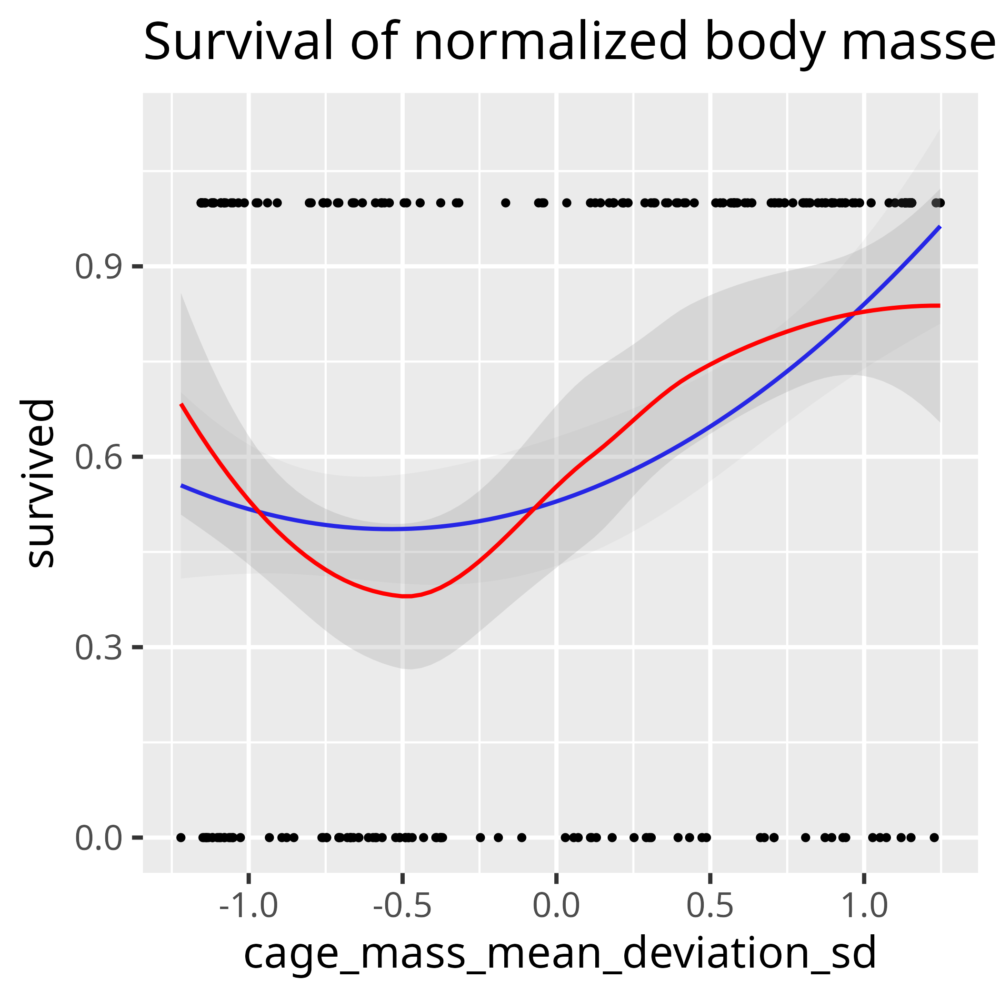
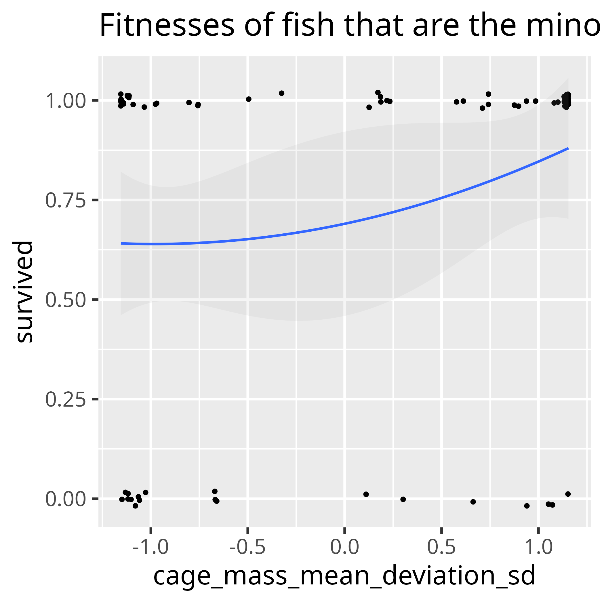

# Bolnick_and_Stutz_2017

Notes for `[Bolnick & Stutz, 2017]`.

## Claim of the paper

Extreme body sizes fare better, when taking the *absolute* of the relative
normalized body mass:

> Figure 2, taking the absolute of the relative body size, in the paper

> Figure 2, taking the absolute of the relative body size, by running [fig2.R](fig2.R)

When taking just the relative
normalized body mass, this pattern breaks down:
 
 * in the lake: smaller individuals thrive
 * in the stream: bigger individuals thrive.

With 95% confidence interval added:

Merge all four treatments:

## Is there evidence that the extreme phenotypes survive better?

With a parabolic fit: yes

With a LOWESS fit: no

# Do minority fish have a higher fitness at the extremes?

No.

## References

- `[Bolnick & Stutz, 2017]` Bolnick, Daniel I., and William E. Stutz.
  "Frequency dependence limits divergent evolution by favouring rare
  immigrants over residents." Nature (2017).
