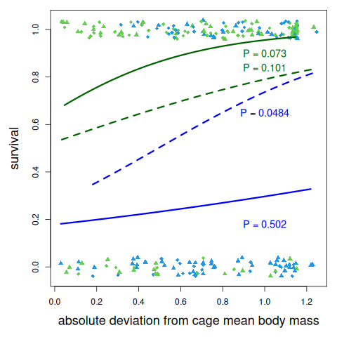
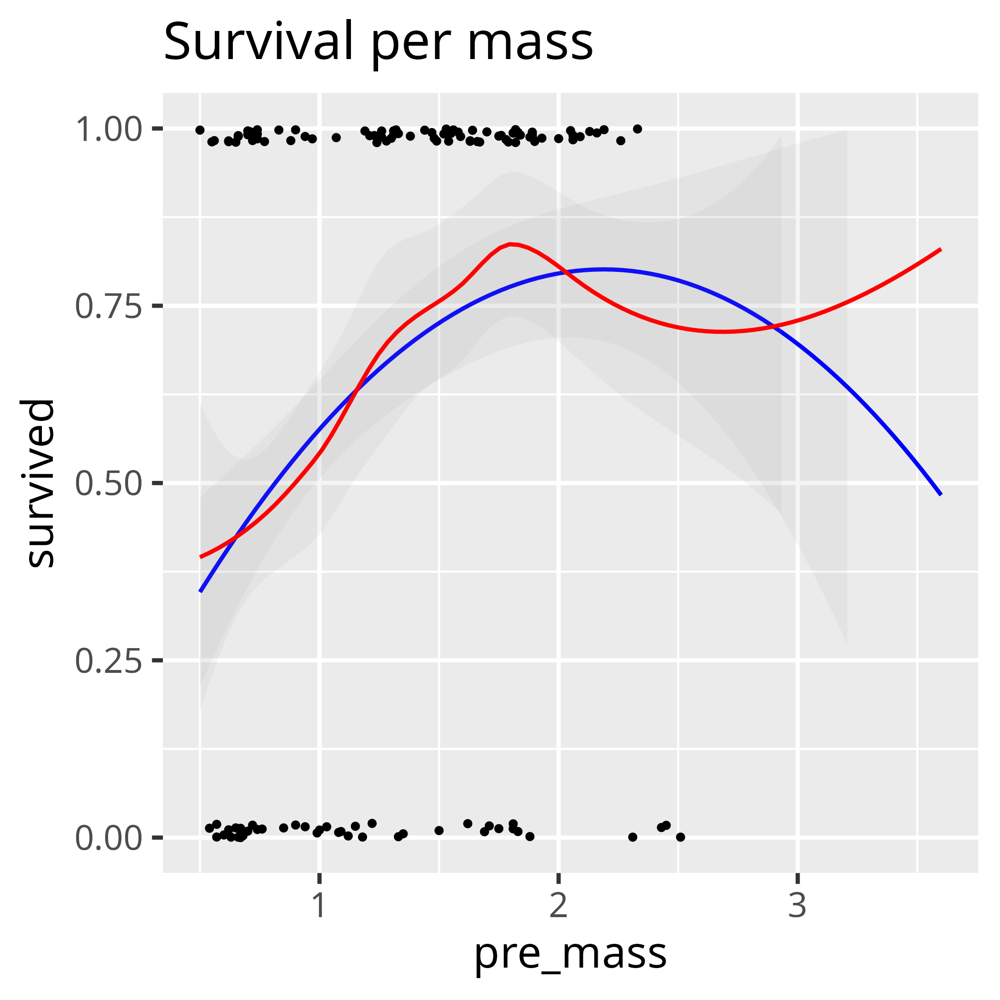

# Bolnick_and_Stutz_2017

Notes for `[Bolnick & Stutz, 2017]`.

The conclusion of the paper is that extreme body sizes fare better.
This can be shown in a plot that uses the *absolute* of the relative
normalized body mass, as shown in plot versions A (from the paper)
and B (reproduced from data) below.

When taking just the relative
normalized body mass, this pattern breaks down,
as shown in plot version C shown below.

Instead, the conclusion should be:
 
- in the lake: smaller individuals thrive
- in the stream: bigger individuals thrive.

Version|Figure 2 version|Description
-------|---------------------------------------------------|---------------------------------------------------
A      |   |As in paper
B      |       |Reproduced using auhor's code, see [fig2_complete.R](fig2_complete.R)
C      ||Reproduced using the real valus, see [fig2_complete.R](fig2_complete.R)

## Extra figures

With 95% confidence interval added:

Merge all four treatments:

## Is there evidence that the extreme phenotypes survive better?

With a parabolic fit: yes

With a LOWESS fit: no

# Do minority fish have a higher fitness at the extremes?

No.

## References

- `[Bolnick & Stutz, 2017]` Bolnick, Daniel I., and William E. Stutz.
  "Frequency dependence limits divergent evolution by favouring rare
  immigrants over residents." Nature (2017).
